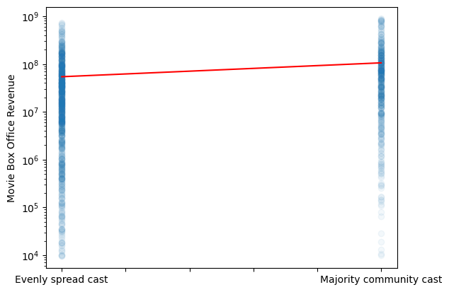

The global film industry is a **$100 billion worth industry**. There is a vast potential to earn money, and the producers are willing to sacrifice considerable costs to become a movie success. Pirates of the Caribbean: On Stranger Tides, the most expensive film, cost $379 million. With such an amount at your disposal, you may wonder how you should spend the money. Should you use them to get one of the biggest movie stars in your cast? For many, this may be tempting. One of the most famous actors, Tom Cruise, was rewarded $100,000,000 for his performance in Top Gun: Maverick. But was it worth it? Or could the money be better spent? 

### The Data Used:
We will be using the CMU Movie Summary Corpus which contains data on the revenue of **8 401 movies**. We will analyze this data to create a recipe for a successful movie.

### Goal:

In our initial analysis, we define the success of a movie in terms of box office revenue. To create a recipe for the production of a successful film, we have limited ourselves to five main research questions:

* Does the movie release date have a significant impact on the success of a film, and if so, what is the optimal release date concerning the time of the year? Subsequently, the question arises whether this result differs for different genres.
* How do the gender ratio and the fraction of ethnicities in the cast affect the success of a movie?
* Do certain actors have a significant positive or negative impact on the success of a movie?
* Is the length of a movie related to its success, and if so, in what way?
* Is the use of negatively connoted words, positively connoted words, and words related to violence in the movie plot associated with the success of the movie?

-----------------

## Release Date

This is the interactive plot:

<iframe src="assets/plot/genre-plot-sm.html" width="750px" height="530px" frameborder="0" position="relative">Genre plot</iframe>

-----------------------

## Diversity

### 1. Ethnicity

#### Fig. 1.1: Movie Distribution
<iframe src="assets/plot/distribution_ethnicity.html" width="750px" height="530px" frameborder="0" position="relative">Genre plot</iframe>

#### Fig. 1.2: Revenue - Overall
<iframe src="assets/plot/revenue_ethnicity_bar.html" width="750px" height="530px" frameborder="0" position="relative">Genre plot</iframe>

#### Fig. 1.3: Revenue - Over Time
<iframe src="assets/plot/revenue_ethnicity.html" width="750px" height="530px" frameborder="0" position="relative">Genre plot</iframe>

### 2. Gender

#### Fig. 2.1: Movie Distribution
<iframe src="assets/plot/distribution_gender.html" width="750px" height="530px" frameborder="0" position="relative">Genre plot</iframe>

#### Fig. 2.2: Revenue - Overall
<iframe src="assets/plot/revenue_female_bar.html" width="750px" height="530px" frameborder="0" position="relative">Genre plot</iframe>

#### Fig. 2.3: Revenue - Over Time
<iframe src="assets/plot/revenue_gender.html" width="750px" height="530px" frameborder="0" position="relative">Genre plot</iframe>

-----------------------

## Cast
In this analysis, we aim to investigate the influence of a movie's cast on its box office revenue. By analyzing the CMU Movie Summary Corpus dataset, we will explore the potential impact of individual actors and combinations of actors on a film's financial success. To further understand the relationship between cast and revenue, we will conduct network analysis to evaluate the roles of individual actors and actor combinations in generating revenue.

### Summary
- Our analysis found that actors are significant contributors to a movie's box office revenue, as seen in the linear regression model. 
- Our network analysis revealed that actors tend to form communities that frequently work together on films. 
- By examining these communities, we discovered that movies tend to have higher revenues when the cast is drawn from a single community, rather than mixing actors from multiple communities.

### Linear Regression
We are using linear regression to examine the relationship between a movie's cast and its box office revenue. By fitting a linear model to the data, we can determine the strength and direction of the relationship between these variables, as well as identify any potential confounding factors that may influence the relationship. Linear regression allows us to quantitatively estimate the impact of the individual actors on a movie's financial performance.

We have chosen to only include those who have appeared in more than 10 movies. This threshold of 10 has the advantage of excluding one-hit wonders from our analysis, which can help to ensure that our findings are more representative of the broader movie industry. While it is possible for actors who have appeared in fewer than 10 movies to have a significant impact on a film's financial performance, these cases are likely to be less reliable and may not accurately reflect broader trends in the industry. By limiting our analysis to actors who have a more established track record in the movie industry, we can confidently draw conclusions about the factors that contribute to financial success in the film industry. Overall, our findings will be more reliable and meaningful when we focus on experienced and reliable actors who have a strong track record in the industry.

<table>
  <tr>
    <th>Variable</th>
    <th>coef</th>
    <th>std err</th>
    <th>t</th>
    <th>P>|t|</th>
    <th>[0.025</th>    <th>0.975]</th>
  </tr>
  <tr>
    <td>Cate Blanchett</td>
    <td>107800000.0</td>
    <td>25000000.0</td>
    <td>4.305</td>
    <td>0.000</td>
    <td>58700000.0</td>
    <td>157000000.0</td>
  </tr>
  <tr>
    <td>Seann William Scott</td>
    <td>83170000.0</td>
    <td>23300000.0</td>
    <td>3.571</td>
    <td>0.000</td>
    <td>37500000.0</td>
    <td>129000000.0</td>
  </tr>
  <tr>
    <td>budget</td>
    <td>81760000.0</td>
    <td>3310000.0</td>
    <td>24.671</td>
    <td>0.000</td>
    <td>75300000.0</td>
    <td>88300000.0</td>
  </tr>
    <tr>
    <td>James Franco</td>
    <td>74500000.0</td>
    <td>24600000.0</td>
    <td>3.026</td>
    <td>0.003</td>
    <td>26200000.0</td>
    <td>123000000.0</td>
  </tr>
  <tr>
    <td>Johnny Depp</td>
    <td>60650000.0</td>
    <td>21000000.0</td>
    <td>2.890</td>
    <td>0.004</td>
    <td>19500000.0</td>
    <td>102000000.0</td>
  </tr>
  <tr>
    <td>Anna Faris</td>
    <td>58480000.0</td>
    <td>22600000.0</td>
    <td>2.593</td>
    <td>0.010</td>
    <td>14200000.0</td>
    <td>103000000.0</td>
  </tr>

</table>

One interesting finding from our analysis is that, among the top 10 coefficients with the highest magnitudes and p-values below 0.05, the only factors that appear to significantly influence movie revenue besides budget are the actors. This suggests that these actors make a significant contribution to the revenue. However, it's important to keep in mind that the contribution of an actor to revenue may not solely depend on their individual performance, but also on the combination of actors they appear with in a movie. For example, an actor may have a stronger influence on revenue when paired with certain co-stars, but a weaker influence when paired with others. This highlights the need to further analyze movie casts using network analysis techniques to gain a more nuanced understanding of the relationships between actors and their impact on revenue. For example, will Cate Blanchett rank among the top revenue-generating actors when we take actor communities into consideration?

Additionally, we should note that budget is a significant factor that can impact revenue, but is closely related to revenue itself and may not be the most informative when analyzing the contribution of individual actors. We will return to the role of budget in our analysis later.

### Network Analysis of Actors
In the context of analyzing the impact of actors on movie revenue, network analysis allows us to look at the connections between actors and how they may influence each other's contribution to revenue. By visualizing the relationships between actors as a network, we can identify patterns and communities within the movie industry, and gain a more nuanced understanding of the ways in which actors contribute to revenue. Overall, incorporating network analysis into our analysis of actor contributions to movie revenue can provide valuable insights and help us better understand the complex relationships within the data.

- We have created a flavor network graph where the nodes represent actors and the edges represent the movies that they have appeared in together. The size of the nodes reflects the average revenue of the movies that the actor has appeared in, while the width of the edges indicates the number of times that the actors have appeared in a movie together.
- This graph includes 61 actors and 256 connections. In the following section, we will delve deeper into this visualization to gain insights into the relationships between actors and their influence on revenue.

- To gain a deeper understanding of the relationships depicted in our flavor network graph, we will utilize network analysis techniques to identify communities of actors who frequently appear in movies together and to measure the centrality of each actor in the network.

- To identify communities of actors, we will apply a network community detection algorithm. This will allow us to identify groups of actors who tend to appear in movies together and examine how these communities contribute to movie success. In particular, we will use the Louvain method to identify the "best" partition of communities in the network. By identifying these actor communities, we can gain a more detailed understanding of the patterns of collaboration and the impact of different actor combinations on movie revenue.

<button style="background-color: #003e1f; color: white; border: none; padding: 10px 20px; 0; cursor: pointer; width: 30%; border-radius: 10px; font-size: 11px; margin-left: 240px;" onclick="swapImage()">Average revenue on/off</button>

- Using the Louvain method, we have partitioned the network of actors into six distinct communities based on their connections through movies. This suggests that there are subgroups of actors who tend to work together more frequently. 
- Upon further analysis, we found that the average revenue generated by actors within each community varies, with some actors standing out as particularly successful in terms of average revenue.
- While we have not yet explored the potential reasons for these patterns, some possibilities could include the genre or type of film associated with each community, the fame or recognition of the actors within the industry, or the social connections between the actors. 
- For the purpose of our analysis, we are interested in examining how revenue is affected by including actors from different communities versus including actors from the same community. This will allow us to gain insights into the impact of actor combinations on movie revenue.

- We will plot the initial flavor graph again, but this time we will distinguish between connections within communities and those between communities. This will allow us to see the patterns of collaboration within and between different actor communities and better understand the impact of these connections on movie revenue. 

<button style="background-color: #003e1f; color: white; border: none; padding: 14px 20px; margin: 8px 0; cursor: pointer; width: 20%; border-radius: 10px; font-size: 11px; margin-left: 130px; margin-right: 5px" onclick="swapImage3('assets/img/flavor_graph_different_edges.png')">All connections</button>
<button style="background-color: #003e1f; color: white; border: none; padding: 14px 20px; cursor: pointer; width: 20%; border-radius: 10px; font-size: 11px; margin-right: 5px;" onclick="swapImage3('assets/img/community_graph.png')">Community</button>
<button style="background-color: #003e1f; color: white; border: none; padding: 14px 20px; cursor: pointer; width: 20%; border-radius: 10px; font-size: 11px;" onclick="swapImage3('assets/img/non_community_edges.png')">Non-community</button>

In this revised flavor plot, we have highlighted the edges that cross between two different actor communities in yellow. The other edges have a colour corresponding to their community. Our goal is to determine whether there is a difference in revenue when creating a movie cast with actors from a single community versus actors from multiple communities. To do this, we will analyze the patterns of collaboration within and between communities and examine the impact of these connections on movie revenue. Let's delve deeper into this analysis!

To gain a deeper understanding of the relationships between actors and their impact on revenue, we will divide the movies into two categories: those with a cast that is largely concentrated within a single actor community, and those with a cast that is more evenly distributed among multiple communities. This will enable us to compare the performance of movies with more homogenous casts versus those with more diverse casts, and determine whether there is a relationship between cast composition and revenue. By analyzing these two categories of movies, we can gain insights into the potential benefits and drawbacks of casting actors from a single community versus a mix of communities, and how this may impact the success of a movie.

We observed a significant difference in the average revenue between movies with a cast that is largely concentrated within a single community and those with a more evenly distributed cast. To more accurately assess the impact of cast composition on revenue, it is important to consider other factors that could influence the results. One way to control for these potential confounds is through the use of matching, which allows us to compare movies with similar characteristics. By controlling for these other factors, we can more confidently attribute any observed differences in revenue to the effect of cast composition. This will help us better understand the relationship between cast composition and movie revenue and identify any trends or patterns. The following plots show a difference-in-difference approach on matched and unmatched data. 

Our revised difference-in-differences analysis revealed that movies with a majority of actors from a specific community have a significant impact on box office revenue. The treatment effect was substantial in both estimates, with and without matching, at $51620924.7 and $39424016.7, respectively. The difference between the two estimates was approximately -23.63%, and both estimates were statistically significant with a p-value of 0.0.

In this analysis, we chose to exclude budget as a matching variable because it is likely closely related to actor cast. Using budget as a matching variable could potentially control for the effect of the actor cast, making it difficult to determine the independent effect of the actor cast on revenue. However, budget is an important factor that can influence a movie's production value and overall appeal to audiences. For example, a movie with a high budget may be more likely to generate revenue due to a larger marketing budget and wider distribution.

Although we do not have data on how budgets were specifically allocated for each movie, we speculate that a significant portion of the film's budget is often used for casting. It is possible that it is more costly to assemble a cast primarily from one community, which is irrelevant for our analysis of how movie cast affects revenue made.

-----------------------

## Runtime
Next, we investigate: Does a movie's runtime affect the box office revenue? 

### Distribution
Before we dive into the topic, we first look at the distribution of runtime across all movies with a histogram. From the log histogram, we can see that most of the movies have runtime within the 85-120 minute interval.
<iframe src="assets/plot/runtime_hist.html" width="750px" height="630px" frameborder="0" position="relative">Runtime Histogram</iframe>

The first step to discover the relationship is through linear regression between runtime and revenue. From our model, there is a slight positive linear relationship between runtime and revenue. However from the regression analysis, the R squared value (0.035) is too small to justify the dependency between runtime and revenue. We also see that movie with runtime between 80-120 minutes have similar distribution of revenue and movies with runtime less than 80 minutes generate less revenue (highet revenue is below $400000000). Thus we can raise the question that if 80 minute could be a threshold for movie's revenue performance and we will address it in the next section.

### Does it hurt if runtime is too short?
We define short movie to have runtime < 80min and other (non-short) movie to have runtime >= 80min. Here we examine the histogram overlaying the revenue between two classes of movies. We see that all short movies in the dataset does not exceed 225 million and there are quite a few non-short movies with very high revenues.

<iframe src="assets/plot/short_vs_nonshort.html" width="750px" height="630px" frameborder="0" position="relative">short vs nonshort Histogram</iframe>

Then we perform independent t-test between revenues of short and non-short movies. the t-test gives us a small p-value (<< 0.05), which indicates a statistically significant difference between the samples. Further, the mean difference tells us that short movies (< 80min) generally generates less revenue than non-short (>=80min) movies. We can conclude that movies should not be too short as short movies have **54.8%** less revenue than non-short movies.

### Are blockbuster movies generally longer in runtime?
To answer this question, we define blockbusters as movies with revenue >= 400 million USD and non-blockbusters as movies with revenue < 400 million USD.

We perform independent t-test between runtime between blockbuster and non-blockbuster movies which gives us a small p-value (<< 0.05), which indicates a statistically significant difference between the samples. Further, the mean difference tells us that the blockbuster runtime is generally longer than non-blockbuster. We can conclude that longer runtime are more successful, as **blockbuster movies have 10.05% longer runtime than non-blockbuster movies**.

-----------------------

## Plot Summary
In this analysis, we decide to look into plot summary and specifically if words with positive, negative and violent connotations have an impact on a movie's box office revenue.
To make it a fair measure for all movies with various plot length, we will take the proportion of positive, negative, violent words in the plot so that the standard will be normalized from 0 to 1.

### Linear Regression
To commence the analysis, we perform linear regression of positive, negative, violent word proportion with respect to revenue and discover if there is any linear relationship.

<iframe src="assets/plot/positive_scatter.html" width="750px" height="330px" frameborder="0" position="relative" display="inline">positive scatterplot</iframe>
<iframe src="assets/plot/negative_scatter.html" width="750px" height="330px" frameborder="0" position="relative" display="inline">negative scatterplot</iframe>
<iframe src="assets/plot/violent_scatter.html" width="750px" height="330px" frameborder="0" position="relative" display="inline">violent scatterplot</iframe>

From the scatterplot, we see that 
- there is a negative linear relationship between positive word proportion and revenue. 
- In contrast, there is a positive linear relationship between negative word proportion and revenue. 
- There is also a positive linear relationship between violent word proportion and revenue.
However from our regression analysis, the R squared value is too small to justify the dependency between all sentiments and revenue.
We see a opposing relationship between positive and negative plots and we will discover if more positive plot or more negative plot can boost the revenue in the following section.

### More positivity or more negativity?
We continue our analysis that if plots with more positive word proportions will generate more revenues than those with more negative word proportions.

By performing independent t-test between revenues of more positive and more negative plot movies, it gives us a small p-value which indicates a statistically significant difference between the samples.
Further, the mean difference tells us that movies with more positive plot generally has less revenue than movies with more negative plot.

We can conclude that movies with more negative plot are more successful, as movies with more negative plot have **45.3%** more revenue than movies with more positive plot.

### Blockbuster's special sentiments
So how do the sentiments look on all blockbusters compared to non-blockbusters.
(Note: we previously defined blockbusters as movies with revenue >= 400 million USD and non-blockbusters as movies with revenue < 400 million USD.)
To investigate this question, we perform independent t-tests between positive/negative/violent word porportions of blockbusters and non-blockbusters and present the results below.

For all independent t-tests, they give us a small p-value, which indicates a statistically significant difference between the samples.
- Positive: blockbuster movies generally has smaller positive word proportion in summary than non-blockbuster. We can conclude that less positive plot components are more successful, as blockbuster movies have **10.2% less positive word usage** than non-blockbuster movies.
- Negative: blockbuster movies generally has higher negative word proportion in summary than non-blockbuster. We can conclude that more negative plot components are more successful, as blockbuster movies have **12.4% more negative word proportion** than non-blockbuster movies.
- Violent: blockbuster movies generally has higher violent word proportion in summary than non-blockbuster. We can conclude that more violent plot components are more successful as blockbuster movies have **36.9% higher violent word proportion** than non-blockbuster movies.

-----------------------

## Conclusion & Our recipe

-------------
