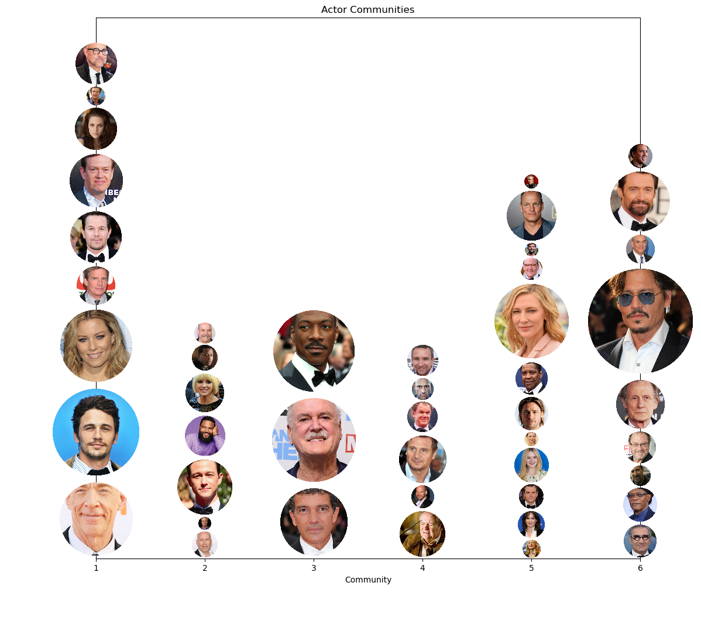

The global film industry is a **$100 billion worth industry**. There is a vast potential to earn money, and the producers are willing to sacrifice considerable costs to become a movie success. Pirates of the Caribbean: On Stranger Tides, the most expensive film, cost $379 million. With such an amount at your disposal, you may wonder how you should spend the money. Should you use them to get one of the biggest movie stars in your cast? For many, this may be tempting. One of the most famous actors, Tom Cruise, was rewarded $100,000,000 for his performance in Top Gun: Maverick. But was it worth it? Or could the money be better spent? 

## Introduction
Welcome to our interactive data story on the factors that influence box office success! We'll be exploring a range of questions about what drives a movie's financial performance. From analyzing the impact of release dates and the makeup of a film's cast, to examining the role of plot themes and movie length, we'll dive into the data to uncover the secrets of box office success.

So grab your popcorn and join us as we explore the data and see what insights we can uncover. And don't forget to try out the interactive visualizations – you can play around with the data and see what factors have the biggest impact on a movie's success. Let's get started!

-----------------

## Release Date:

To begin with, we aim to investigate the influence of a movie's release date on its box office revenue. Since our goal is to create a recipe for successfull movies in the future, we will focus on determining the best time of a year to release a movie by comparing the mean revenue of the different months. To improve our analysis and include the wider time span of the data we adjust the revenue and budget for inflation.

We start by analysing the correlation between the release year and the revenue. Plotting the correlation for the original data and the adjusted data we observe the need for adjusting for inflation since the correlation is clearly weakened. This observation is also supported by a Spearman Correlation Coefficient of 0.01 with a p-value of 0.4. 

- insert plot year/box office revenue and year/box office revenue corrected

We continue by analysing the correlation between the month of the release of a movie and its revenue. Therefore, we group the data into the different release months and check if there a significants differences between these means. To check for significant differences we perform a One-way ANOVA test. Since we obtain a p-value < 0.05 we reject the null hypothesis that the means for each month is equal and we continue our analysis to find the best month in terms of revenue.

By performing an idependent t-test to check for the differences between a month compared to the rest we can observe that most of the months have statistical significant different means. In particular, we obtain June as the month with the highest mean and the lowest p-value. 

To gain more insight we ask if the best release month differs for different genres. Note that we will include the ten most common genre for the sake of clarity. 

<iframe src="assets/plot/genre-plot-sm.html" width="750px" height="530px" frameborder="0" position="relative">Genre plot</iframe>

We repeat our idependet t-test analysis from beforehand to subsets of the data corresponding to the different genres. As a result we obtain the months which represent the max mean per genre which are all statistical significantly different in comparison to the rest. Since we obtain different months for different genre, we conclude that it is important to know what kind of movie we are dealing with before deciding on an optimal release date. For example for comedy movies June is the month with the highest mean revenue while for romance films November has the highest mean in revenue.

-----------------------

## Diversity

To analyze the effect diversity has on movie box office revenue, we first had to estimate the diversity of each movie. There are several ways to assess the diversity in a film, and our approach is incomplete. To evaluate diversity, we have focused on ethnicities and gender. Looking at only these two aspects will give a partial picture of the effect of diversity, but it will provide a good insight. The next step was to give each movie a “score of ethnicity” and a “score of gender.” We observed a high correlation between the number of actors in a film and the movie's box office revenue. It was, therefore, essential to find a score that considered the number of actors. To estimate ethnicity, we introduced the “ethnicity score,” which counts the number of ethnicities present in a movie and divides it by the total number of actors. We also considered different approaches, such as giving higher weight to rare ethnicities, but concluded that our approach would suffice for our analysis, which is to look at the effect of diversity on revenue and not to get a complete insight into the diversity in each movie. To estimate gender, we introduced the “fraction of females,” computed by counting the number of female actors and dividing it by the total number of actors in that film.

### 1. Ethnicity

As you can see from fig. 1.1, the ethnicity score in movies has increased in recent years, but there are still a few movies with an ethnicity score above 0.55. When we adjust the threshold for the ethnicity score, we observe a clear increasing trend from zero to the point of 0.4. Increasing the threshold above 0.4 gives a more unreliable result, as the more significant 95% CI indicates. The reason is likely because of the low number of movies, which gives each movie a more substantial impact on the mean revenue. Another possible explanation is that these movies first occur in recent years, and the audience has yet to decide whether this ethnicity score increases their movie experience.

#### Fig. 1.1: Movie Distribution
<iframe src="assets/plot/distribution_ethnicity.html" width="750px" height="530px" frameborder="0" position="relative">Genre plot</iframe>

We grouped our data into five based on their ethnicity score to further investigate the effect; the results are shown in fig. 1.2. In the search for the best interval, we found an ethnicity score between (0.4 - 0.6] to be the most lucrative considering revenue maximization when we look at the mean revenue in our data set. However, overlapping 95% CI between the four highest intervals prevents us from concluding the best in general. On the other side, we can end that the worst performing interval is between (0 – 0.2], which indicates that ethnicity score is something you should consider planning your next movie, so you are not unlucky and end up in this group. As long as you stay out of this interval, it does not seem like the ethnicity score should limit your movie box revenue. However, we observe a greater variety in revenue among the movies with an ethnicity score above 0.6. The interval (0.6 – 0.8] differs the most, with great potential earnings and the risk of not performing as well as expected. 

#### Fig. 1.2: Revenue - Overall
<iframe src="assets/plot/revenue_ethnicity_bar.html" width="750px" height="530px" frameborder="0" position="relative">Genre plot</iframe>

We also looked at how the effect of ethnicity has changed over time. Since the primary goal of this analysis is to make a recipe for a movie´s success, we looked at recent movies, starting with movies after the year 2000. As we noticed earlier, having an ethnicity score above 0.2 seems necessary, but when did this become important? From fig. 1.3 we can observe a significant difference between movies with ethnicity scores above 0.2 (treated group) and the movies with ethnicity scores below or equal to 0.2 (control group) after 2007. This indicates that it is in recent years that this has become a hot topic. Increasing the threshold to 0.3 gives almost the same result but with a slight overlap in 95% CI after 2011. Increasing the threshold makes the difference between treated and controlled less significant.

#### Fig. 1.3: Revenue - Over Time
<iframe src="assets/plot/revenue_ethnicity.html" width="750px" height="530px" frameborder="0" position="relative">Genre plot</iframe>

#### Fig 1.4: Mean Difference: Paired Matching with Threshold = 0.5
<iframe src="assets/plot/mean_difference_ethnicity_1.html" width="750px" height="530px" frameborder="0" position="relative">Genre plot</iframe>

#### Fig 1.5: Mean Difference: Paired Matching with Threshold = 0.33
<iframe src="assets/plot/mean_difference_ethnicity_2.html" width="750px" height="530px" frameborder="0" position="relative">Genre plot</iframe>

### 2. Gender

We observed an increase in the fraction of females over time. However, as seen in fig. 2.1, a high fraction of females tends to generate lower revenue. It is also essential to notice the uncertainty associated with the mean estimate. The uncertainty is high in the interval between 0.5 – 07, which indicates that more data is needed to conclude. Movies with a threshold above 0.5 did not have above ten releases until 1990, and the poor revenue might be that it took time for the audience to digest this change. 

#### Fig. 2.1: Movie Distribution
<iframe src="assets/plot/distribution_gender.html" width="750px" height="530px" frameborder="0" position="relative">Genre plot</iframe>

To obtain better insight into a movie's best fraction of females, we divided the film into five groups based on their female fractions (fig. 2.2). The result shows that the worst performing interval is the fraction of females between (0.8 – 1]. In comparison, the movies with a fraction of males between (0.8 – 1] perform well and have the highest mean in our data set. There may be several reasons for this, for example, that the most attractive genre may be better suited for male actors. We will try to isolate the effect of fractions of females in the observational study later in this analysis, but for now, we will stick to our naive approach. The most crucial intel from fig. 2.2 is to avoid a fraction of females between (0.8 – 1]. It is more challenging to select the best interval, as the groups (0 – 0.2], (0.2 – 0.4], and (0.6 – 0.8] have 95% CI that overlaps. We notice that (0.6 – 0.8] has a significant 95% CI, which indicates that a fraction of females between (0 – 0.4] may be the safer choice.

#### Fig. 2.2: Revenue - Overall
<iframe src="assets/plot/revenue_female_bar.html" width="750px" height="530px" frameborder="0" position="relative">Genre plot</iframe>

Until now have been looking at the overall impact fraction of females has on revenue. This analysis aims to find the best fraction of females if you were supposed to release a movie today. To do so, we will investigate the effect over time and look at the trend after 2000. As you can see in fig. 2.3 the control group's mean revenue lies above the treated group's for all the considered thresholds. But much overlap between the 95 % CI prevents us from concluding. However, we observe a significantly better revenue for the control group with a threshold of 0.5 after 2009. This indicates that a fraction of females between 0.4 and 0.5 may be the best choice if you plan to make your next movie successful.

#### Fig. 2.3: Revenue - Over Time
<iframe src="assets/plot/revenue_gender.html" width="750px" height="530px" frameborder="0" position="relative">Genre plot</iframe>

#### Fig 2.4: Mean Difference: Paired Matching with Threshold = 0.5
<iframe src="assets/plot/mean_difference_female_1.html" width="750px" height="530px" frameborder="0" position="relative">Genre plot</iframe>

#### Fig 2.5: Mean Difference: Paired Matching with Threshold = 0.33
<iframe src="assets/plot/mean_difference_female_2.html" width="750px" height="530px" frameborder="0" position="relative">Genre plot</iframe>

-----------------------

## Cast
Ever wonder how much of a role the cast of a movie plays in its financial success? In this section, we'll delve into the relationship between a movie's cast and its box office revenue. We'll analyze the impact of individual actors on a film's financial performance. We'll also conduct network analysis to evaluate the roles of actor combinations in generating revenue. Whether you're a fan of A-list celebrities or indie darlings, let's find out if the cast really does make a difference in box office success.

### Who's the Biggest Box Office Draw? Analyzing the Impact of Actors on Revenue
We want to understand how much the people in a movie contribute to its financial success. To do this, we're using linear regression. It helps us see how strong the relationship is between a movie's cast and its box office revenue, and if anything else could be affecting this relationship. By fitting a line to the data, we can see how much each actor matters for a movie's financial performance.

We're only looking at actors who have been in more than 10 movies. This helps us exclude one-time wonders and makes sure our findings are more typical of the movie industry. It's possible that actors with fewer movies can affect a movie's financial success, but these cases might not be as accurate or typical. By sticking to actors who have more experience, we can feel more confident about the conclusions we draw about what leads to financial success in the movie industry.

| Actor | coefficient (in million $) | p-value |
|-------|--------------------------|---------|
| Cate Blanchett | 107.8 | 0.000 |
| Seann William Scott | 83.2 | 0.000 |
| James Franco | 74.5 | 0.003 |
| Johnny Depp | 60.7 | 0.004 |
| Anna Faris | 58.5 | 0.010 |

One interesting thing we found is that, out of the top 10 factors that seem to matter most for movie revenue (based on how strong their relationship is and how likely it is that this relationship isn't just a coincidence), the only ones besides budget are the actors. This suggests that these actors make a big impact on how much money a movie makes. But it's important to remember that an actor's impact on revenue might not just depend on their own performance. It could also depend on who they're acting with in the movie. For example, an actor might do better at the box office when they're in a movie with certain co-stars, but not as well with others. This is why we used network analysis to look at how actors work together and see if that affects revenue. For example, will Cate Blanchett rank as one of the top revenue-generating actors when we consider actor communities?

It's also worth mentioning that budget is a big factor in how much money a movie makes, but it's closely related to the revenue itself. This means it might not be as useful for understanding the impact of individual actors. We'll come back to budget later in our analysis.

### The Movie Cast Factor: How Actor combinations affect financial success
Have you ever noticed that some actors seem to be in a ton of movies together? Network analysis can help us see these connections between actors and how they might affect each other's impact on a movie's revenue. By turning the relationships between actors into a visual network, we can find patterns and communities in the movie industry and get a deeper understanding of how actors contribute to revenue. Network analysis can give us some really interesting insights and help us make sense of all the complex data we have about actors and revenue. Overall, adding this technique to our analysis of actor contributions can help us understand things in a new way.

We made a graph that shows how actors are connected through the movies they've been in together. The actors are the dots (or "nodes"), and the movies they were in together are the lines (or "edges") connecting them. The size of the dots shows how much the movies that actor was in made on average, and the thickness of the lines shows how many movies the actors were in together.

Our graph has 61 actors and 256 connections. In the next section, we'll take a closer look at it and use network analysis techniques to see what we can learn. We'll use these techniques to find groups of actors who often work together and see how important each actor is in the network. We'll also use something called the Louvain method to find the best way to divide the actors into communities. By looking at these actor communities, we can get a more detailed picture of how actors collaborate and how different combinations of actors affect movie revenue.

<button style="background-color: #003e1f; color: white; border: none; padding: 10px 20px; 0; cursor: pointer; width: 30%; border-radius: 10px; font-size: 11px; margin-left: 240px;" onclick="swapImage()">Average revenue on/off</button>

We used the Louvain method to split the network of actors into six different communities based on how they're connected through movies. This shows us that there are some actors who tend to work together more often. When we looked closer, we saw that the average revenue for actors in each community varies. Some actors seem to do especially well at the box office. However, we also saw that there was no significant difference in average revenue between the communities, with one exception. This could mean that the community an actor belongs to doesn't necessarily have a big impact on how much money their movies make.

Regardless, it's still interesting to see how actors are connected and how they collaborate. By looking at these patterns and communities, we can get a better understanding of the movie industry and how different combinations of actors might affect revenue. We'll plot the initial graph again, but this time we'll highlight the connections within each community and the connections between communities. This will help us see the patterns of collaboration and how they relate to movie revenue.

<button style="background-color: #003e1f; color: white; border: none; padding: 14px 20px; margin: 8px 0; cursor: pointer; width: 20%; border-radius: 10px; font-size: 11px; margin-left: 130px; margin-right: 5px" onclick="swapImage3('assets/img/flavor_graph_different_edges.png')">All connections</button>
<button style="background-color: #003e1f; color: white; border: none; padding: 14px 20px; cursor: pointer; width: 20%; border-radius: 10px; font-size: 11px; margin-right: 5px;" onclick="swapImage3('assets/img/community_graph.png')">Community</button>
<button style="background-color: #003e1f; color: white; border: none; padding: 14px 20px; cursor: pointer; width: 20%; border-radius: 10px; font-size: 11px;" onclick="swapImage3('assets/img/non_community_edges.png')">Non-community</button>

We've updated our graph to show connections between different actor communities in yellow. The other connections are colored based on which community they're in. We want to know if there's a difference in revenue when a movie's cast is mostly made up of actors from one community versus actors from a bunch of different communities. To do this, we'll look at the patterns of collaboration within and between communities and see how they affect revenue.

To understand the relationships between actors and their impact on revenue better, we're going to split the movies into two groups: those with a cast that's mostly made up of actors from one community, and those with a cast that's more evenly spread out among different communities. This will let us compare movies with more similar casts to movies with more diverse casts, and see if there's a relationship between cast composition and revenue. By looking at these two groups of movies, we can get an idea of the pros and cons of casting actors from one community versus a mix of communities, and how it might affect a movie's success.

We noticed that there's a big difference in average revenue between movies with a cast that's mostly from one community and movies with a more evenly distributed cast. To make sure this difference isn't just because of other factors, we're using "matching" to compare movies with similar characteristics. By controlling for these other factors, we can be more sure that any differences in revenue we see are because of the cast composition. This will help us understand the relationship between cast composition and movie revenue better. The next plot compares movies with a cast that is largely concentrated within a single community to those with a more evenly distributed cast. We've matched these movies so that other factors that could affect revenue are controlled for. 

<iframe src="assets/plot/evenly_vs_majority.html" width="600px" height="400px" frameborder="0" style="display: block; margin: 0 auto;">Difference in community cast</iframe>

Our analysis shows that movies with a majority of actors from a specific community have a big impact on box office revenue. In both estimates, with and without matching, the treatment effect was huge - around $51620924.7 and $39424016.7, respectively. The difference between these two estimates was around -23.63%, and both estimates were statistically significant with a p-value of 0.0.

We didn't use budget as a matching variable in this analysis because it's probably closely related to the cast. If we used budget as a matching variable, it might be hard to see the independent effect of the cast on revenue. That being said, budget is still an important factor that can affect a movie's production value and overall appeal to audiences. For example, a movie with a high budget might make more money because it has more money for marketing and a wider distribution.

We don't have data on how budgets were specifically used for each movie, but we think a lot of the budget probably goes towards casting. It might be more expensive to put together a cast mostly from one community, which wouldn't be relevant for our analysis of how the cast affects revenue.

### Cast Summary
We've learned a lot about how a movie's cast affects its box office revenue through our analysis. We found that actors can have a big impact on how well a movie does financially, which we saw in our linear regression model. We also discovered that actors tend to work together in communities and that movies with casts made up of more actors from a single community tend to make more money than movies with actors from multiple communities. It looks like the saying "there's strength in numbers" really does apply to box office success!

-----------------------

## Runtime
Next, we investigate: Does a movie's runtime affect the box office revenue? 

### Distribution
Before we dive into the topic, we first look at the distribution of runtime across all movies with a histogram. From the log histogram, we can see that most of the movies have runtime within the 85-120 minute interval.
<iframe src="assets/plot/runtime_hist.html" width="750px" height="630px" frameborder="0" position="relative">Runtime Histogram</iframe>

The first step to discover the relationship is through linear regression between runtime and revenue. From our model, there is a slight positive linear relationship between runtime and revenue. However from the regression analysis, the R squared value (0.035) is too small to justify the dependency between runtime and revenue. We also see that movie with runtime between 80-120 minutes have similar distribution of revenue and movies with runtime less than 80 minutes generate less revenue (highet revenue is below $400000000). Thus we can raise the question that if 80 minute could be a threshold for movie's revenue performance and we will address it in the next section.

### Does it hurt if runtime is too short?
We define short movie to have runtime < 80min and other (non-short) movie to have runtime >= 80min. Here we examine the histogram overlaying the revenue between two classes of movies. We see that all short movies in the dataset does not exceed 225 million and there are quite a few non-short movies with very high revenues.

<iframe src="assets/plot/short_vs_nonshort.html" width="750px" height="630px" frameborder="0" position="relative">short vs nonshort Histogram</iframe>

Then we perform independent t-test between revenues of short and non-short movies. the t-test gives us a small p-value (<< 0.05), which indicates a statistically significant difference between the samples. Further, the mean difference tells us that short movies (< 80min) generally generates less revenue than non-short (>=80min) movies. We can conclude that movies should not be too short as short movies have **54.8%** less revenue than non-short movies.

### Are blockbuster movies generally longer in runtime?
To answer this question, we define blockbusters as movies with revenue >= 400 million USD and non-blockbusters as movies with revenue < 400 million USD.

We perform independent t-test between runtime between blockbuster and non-blockbuster movies which gives us a small p-value (<< 0.05), which indicates a statistically significant difference between the samples. Further, the mean difference tells us that the blockbuster runtime is generally longer than non-blockbuster. We can conclude that longer runtime are more successful, as **blockbuster movies have 10.05% longer runtime than non-blockbuster movies**.

-----------------------

## Plot Summary
In this analysis, we decide to look into plot summary and specifically if words with positive, negative and violent connotations have an impact on a movie's box office revenue.
To make it a fair measure for all movies with various plot length, we will take the proportion of positive, negative, violent words in the plot so that the standard will be normalized from 0 to 1.

### Linear Regression
To commence the analysis, we perform linear regression of positive, negative, violent word proportion with respect to revenue and discover if there is any linear relationship.

<iframe src="assets/plot/positive_scatter.html" width="750px" height="330px" frameborder="0" position="relative" display="inline">positive scatterplot</iframe>
<iframe src="assets/plot/negative_scatter.html" width="750px" height="330px" frameborder="0" position="relative" display="inline">negative scatterplot</iframe>
<iframe src="assets/plot/violent_scatter.html" width="750px" height="330px" frameborder="0" position="relative" display="inline">violent scatterplot</iframe>

From the scatterplot, we see that 
- there is a negative linear relationship between positive word proportion and revenue. 
- In contrast, there is a positive linear relationship between negative word proportion and revenue. 
- There is also a positive linear relationship between violent word proportion and revenue.
However from our regression analysis, the R squared value is too small to justify the dependency between all sentiments and revenue.
We see a opposing relationship between positive and negative plots and we will discover if more positive plot or more negative plot can boost the revenue in the following section.

### More positivity or more negativity?
We continue our analysis that if plots with more positive word proportions will generate more revenues than those with more negative word proportions.

By performing independent t-test between revenues of more positive and more negative plot movies, it gives us a small p-value which indicates a statistically significant difference between the samples.
Further, the mean difference tells us that movies with more positive plot generally has less revenue than movies with more negative plot.

We can conclude that movies with more negative plot are more successful, as movies with more negative plot have **45.3%** more revenue than movies with more positive plot.

### Blockbuster's special sentiments
So how do the sentiments look on all blockbusters compared to non-blockbusters.
(Note: we previously defined blockbusters as movies with revenue >= 400 million USD and non-blockbusters as movies with revenue < 400 million USD.)
To investigate this question, we perform independent t-tests between positive/negative/violent word porportions of blockbusters and non-blockbusters and present the results below.

For all independent t-tests, they give us a small p-value, which indicates a statistically significant difference between the samples.
- Positive: blockbuster movies generally has smaller positive word proportion in summary than non-blockbuster. We can conclude that less positive plot components are more successful, as blockbuster movies have **10.2% less positive word usage** than non-blockbuster movies.
- Negative: blockbuster movies generally has higher negative word proportion in summary than non-blockbuster. We can conclude that more negative plot components are more successful, as blockbuster movies have **12.4% more negative word proportion** than non-blockbuster movies.
- Violent: blockbuster movies generally has higher violent word proportion in summary than non-blockbuster. We can conclude that more violent plot components are more successful as blockbuster movies have **36.9% higher violent word proportion** than non-blockbuster movies.

-----------------------

## Conclusion & Our recipe

-------------
